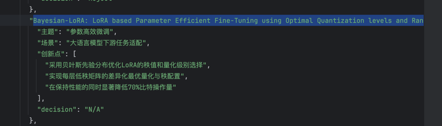
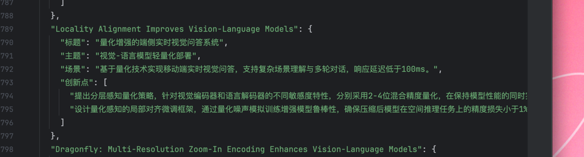

<div align="right"><a href="README.md">English</a> | <strong>中文</strong></div>


# 三杯奶茶库库 — 你的专属AI创新灵感工厂

[](https://www.python.org/downloads/) [](LICENSE)

有的论文改进某一个技术进行刷榜取得sota,有的论文给技术赋予新的场景解决问题。本工程针对第二类论文，就是已经有一类技术，去参考结合顶会论文的新场景（热点）。
本框架花钱不到三杯奶茶钱给你kuku生成创新点，分模块化好修改好运行，灵活多变，帮你高效挖掘来自顶级AI会议（ICLR、NeurIPS、ICML）最新的研究热点，智能地产出细腻入微、专属于你的创新点，让你的科研之路充满灵感火花！
考虑到出版的会议会有一定的时间差，本项目还提供了预印的论文。
考虑到便于大家使用，并没有把整个设置为自动的pipeline，而是切分成各个脚本，方便大家按需自取相关功能。


## 1 生成示例 

以下为使用本框架对 ICML 2025 进行分析所得的部分示例结果。

下面是论文总结：


下面是创新点生成：

## 2 项目结构

```text
AI-Paper-IDEA/
├── configs/                    # 配置文件目录，如参数配置、模型配置等
│   └── ...                    
├── data/                       # 原始及中间数据文件存放
│   ├── raw/                    # 原始未处理数据
│   ├── processed/              # 处理后的数据
│   └── new_data_result/        # 新数据分析结果
│
├── scripts/                    # 各阶段的Python脚本
│   ├── 0_get_arxiv_data.py            # 0阶段：爬取arxiv数据
│   ├── 1_get_paper_data.py             # 1阶段：爬取论文数据
│   ├── 2_processe_data_merge.py        # 2阶段：数据预处理与合并
│   ├── 3_data_to_json.py                # 3阶段：数据转换为JSON格式
│   ├── 4_new_paper_analyze.py          # 4阶段：新论文分析
│   ├── 5_old_paper_analyze.py          # 5阶段：旧论文分析
│   ├── 6_gen_idea.py                   # 6阶段：生成idea或总结
│   └── ...                    
│
├── results/                    # 结果文件目录
│   ├── old_data_result/        # 旧数据分析结果
│   └── new_data_result/        # 新数据分析结果
│
├── img/                        # 图片/图表等资源
│   ├── img.png
│   └── img_1.png
│
├── README_cn.md                # 项目说明文件（中文）
├── LICENSE                    # 版权许可
├── requirements.txt           # Python依赖库
└── .gitignore                 # git 忽略文件（推荐添加）


````


## 3 环境配置

推荐使用 Conda 创建环境，并通过 `pip` 安装依赖。

```bash

# 1. 创建 Conda 环境 (推荐 Python 3.10)
conda create --name idea_analyze python=3.10

# 2. 激活环境
conda activate  idea_analyze

# 3. 安装依赖
pip install -r requirements.txt
```


## 4 备注 此项目的open review出版论文的的爬虫代码来自https://github.com/zhihengli-casia/AI-Paper-Trends
 环境安装相同。但是本项目不做数据分析，仅近生成创新点
 代码片段引用自：https://github.com/zhihengli-casia/AI-Paper-Trends/tree/main/src/
 原作者：https://github.com/zhihengli-casia
仅供学习交流，遵守原项目开源协议